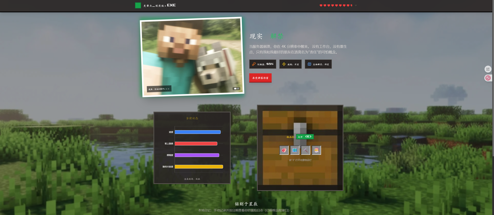

# Steve_Adventure

以《我的世界》为主题的冒险日记应用

<div align="center">

</div>

## 快速开始

### 📱 网页版运行

**前置要求:** Node.js 16+

1. 克隆仓库:
   ```bash
   git clone https://github.com/alen670/Steve_Adventure.git
   cd Steve_Adventure
   ```

2. 安装依赖:
   ```bash
   npm install
   ```

3. 启动开发服务器:
   ```bash
   npm run dev
   ```

4. 打开浏览器访问: http://localhost:3000

### 📦 打包 APK (Android)

**前置要求:**
- Android Studio
- JDK 21
- Node.js 16+

**步骤:**

1. 构建 Web 资源:
   ```bash
   npm run build
   ```

2. 同步到 Android 项目:
   ```bash
   npx cap sync android
   ```

3. 打开 Android 项目:
   ```bash
   npx cap open android
   ```
   或手动用 Android Studio 打开 `android` 目录

4. 在 Android Studio 中:
   - 点击 `Build` → `Build Bundle(s) / APK(s)` → `Build APK(s)`
   - 等待构建完成
   - APK 文件位于: `android/app/build/outputs/apk/debug/app-debug.apk`

**命令行打包 (可选):**
```bash
cd android
.\gradlew assembleDebug
```
生成的 APK: `android/app/build/outputs/apk/debug/app-debug.apk`

## 技术栈

- **前端**: React + TypeScript + Vite
- **移动端**: Capacitor
- **Android**: Java 21 LTS + Gradle 8
- **样式**: CSS Modules

## 项目结构

```
├── components/          # React 组件
├── services/           # 服务层
├── images/             # 图片资源
├── public/             # 静态资源
├── android/            # Android 原生项目
└── scripts/            # 工具脚本
```

## 开发

### 热重载开发
```bash
npm run dev
```

### 构建生产版本
```bash
npm run build
```

### 预览生产构建
```bash
npm run preview
```

## License

MIT
